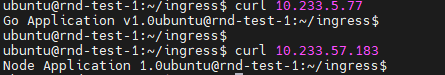
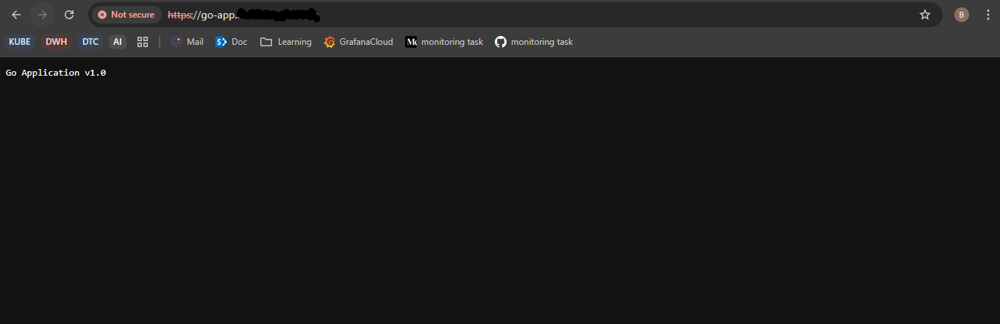
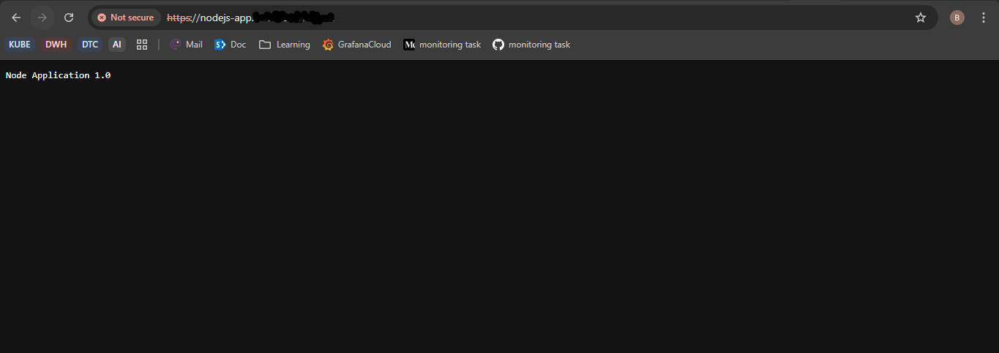
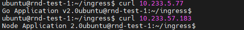

# 🚀 Monorepo Backend Services — CI/CD + Kubernetes Deployment
Repository ini merupakan penyelesaian dari Home Assignment, yang terdiri dari 2 service backend dalam satu monorepo serta implementasi pipeline CI/CD lengkap hingga deployment ke Kubernetes.

# 📦 Struktur Repository
```sh
monorepo/
├── services/
│   ├── go-app/
│   │   ├── Dockerfile
│   │   ├── go.mod
│   │   └── main.go
│   └── nodejs-app/
│       ├── Dockerfile
│       └── app.js
│       └── package.json
├── manifest/
│   ├── go-deploy.yaml
│   └── node-deploy.yaml
└── .gitlab-ci.yml
```

## 1️⃣ Sample Applications
**Go Application (Port 8080)**
Aplikasi sederhana yang menampilkan response:
```bash
Go Application v1.0
```
**Node.js Application (Port 3000)**
Aplikasi sederhana yang menampilkan response:
```bash
Node Application 1.0
```

## 2️⃣ CI/CD Pipeline (GitLab CI)
CI/CD pipeline mencakup:
- ✔ Build image untuk Go App
- ✔ Build image untuk Node.js App
- ✔ Push image ke DockerHub
- ✔ Generate tag otomatis menggunakan $CI_COMMIT_SHA
- ✔ Deploy ke cluster Kubernetes lewat SSH + kubectl apply
Pipeline terdiri dari 2 stage:
```yaml
stages:
  - build
  - deploy
```
🔧 Build Stage
```bash
balamaru/go-app:<CI_COMMIT_SHA>
balamaru/nodejs-app:<CI_COMMIT_SHA>
```
🚀 Deploy Stage
🚀 Deploy Stage

Pada stage ini:
- Manifest Kubernetes ditransfer via scp
- Tag image diganti dinamis via sed
- kubectl apply -f /tmp/ dijalankan di remote host
Contoh deployment manifest:
```yaml
containers:
  - name: go-app
    image: docker.io/balamaru/go-app:{{TAG}}
```
TAG diganti otomatis oleh pipeline.
## 3️⃣ Kubernetes Deployment
Cluster Kubernetes digunakan sebagai environment untuk deploy kedua service.

File manifest:
- manifest/go-deploy.yaml
- manifest/node-deploy.yaml

Keduanya berisi:

- ✔ Deployment
- ✔ Service
- ✔ (optional) ingress

## 4️⃣ (Optional) Public Exposure
Jika ingin expose via domain dapat menjalankan ingress pada kedua file manifest tersebut.

## 5️⃣ Cara Menjalankan / Testing
**🐳 1. Build Image Secara Manual (opsional)**
```bash
docker build -t balamaru/go-app:test ./services/go-app
docker run -p 8080:8080 balamaru/go-app:test
```
**🚀 2. Deploy ke Kubernetes (manual)**
```bash
kubectl apply -f manifest/<file-name>
```
**🌐 3. Akses Service**
```bash
curl http://<service-cluster-ip>
```
<p align="center">  </p>
Jika menggunakan Ingress:
```bash
curl <domain-name>
curl <domain-name>
```
go application 

<p align="center">  </p>

nodejs application
<p align="center">  </p>


**Tambahan setelah melakukan update, dan ci/cd sudah sukses berjalan. Saat di curl ulang**
<p align="center">  </p>

## 6️⃣ Bonus: Monitoring & Logging (Optional)

Jika implementasi monitoring ingin ditambahkan, rekomendasi:

**🔍 Monitoring**
- Prometheus untuk scrape metrics
- Grafana untuk dashboard
- Tambahkan endpoint /metrics
(Go mudah dengan Prometheus client, Node.js bisa pakai prom-client)

**📜 Logging**
- Loki + Promtail
- Kirim log container ke Loki
- Dashboard melalui Grafana

# 📘 Kesimpulan

Repository ini menyelesaikan seluruh task berikut:

- ✔ Membuat dua aplikasi backend (Go + Node.js)
- ✔ Membuat Dockerfile untuk keduanya
- ✔ Membangun CI/CD pipeline lengkap (build → push → deploy)
- ✔ Menggunakan tag commit SHA agar deployment selalu konsisten
- ✔ Menghasilkan manifest Kubernetes untuk deployment
- ✔ Menggunakan DockerHub sebagai registry
- ✔ Deployment otomatis ke cluster melalui SSH + kubectl